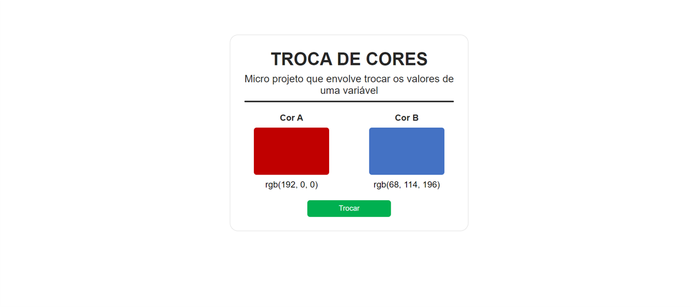

<h1 align="center">
    
</h1>

<h1 align="center">Color Changer</h1>
<h5 align="center">Status: Concluido</h5>

<h2>💻 Sobre</h2>

Micro projeto de aplicação de conceitos basicos de javascript. O projeto envolve trocar as cores de duas caixa, de modo que ao alterar os valores das váriaveis reflita no frontend da aplicação, as cores alternam entre azul e vermelho

<h2>📀 Pré-requisitos e como rodar a aplicação</h2>
1- Clone este repositório [$ git clone https://github.com/PatrickGuilherme/Color-Changer] 
2- Acesse a pasta do projeto 
3- Abra o arquivo index.html

<h2>🔨Tecnologias utilizadas</h2>

As seguintes ferramentas foram utilizadas na construção do projeto:

<ul>
    <li>HTML5</li>
    <li>CSS3</li>
    <li>Javascript</li>
</ul>

<h2>👦 Autor</h2>
<h4>PATRICK GUILHERME DA SILVA</h4>

E-mail: patrick.guilhermedasilva@gmail.com

Linkedin: www.linkedin.com/in/patrick-gs

